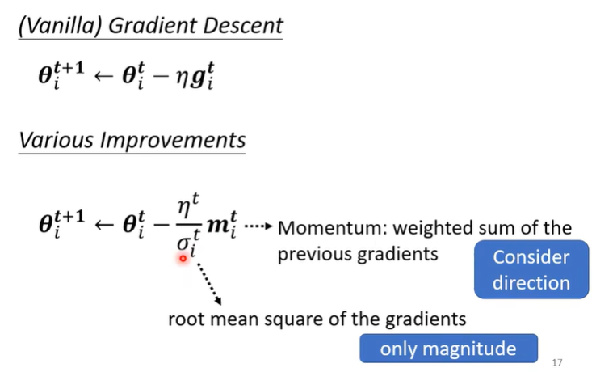

# _deep-learning notes_

1. Logistic回归和Linear回归的区别如下图所示。两点区别：Logistic回归在Linear回归的基础上加了个Sigmoid函数；损失函数Logistic回归使用的是交叉熵损失函数，Linear回归是平方差损失函数。梯度下降策略一致。
   
2. 优化思路：
   
3. optimization不满意的原因
   * 到了局部最优点或者鞍点导致梯度下降无法继续优化。使用mini-batch和动量（Momentum）的方法可以解决局部最优和鞍点的问题。
   
   * 动态学习率：Adam=RSMProp+Momentum
   
      + RSMProp：
      + Momentum：梯度下降的时候最后面称的不是梯度，而是动量（之前梯度和当前梯度的综合）。
   